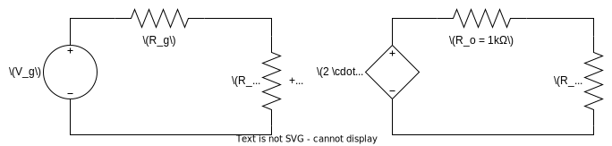

Electronic Systems

# Assignment 1: Review of Fundamental Concepts

Academic year 2024-2025

Alonso Herreros Copete

---

## Self-test Questions

### Question 1
What mathematical function corresponds to a signal amplifier? Consider a sinusoidal voltage signal
with a peak- to-peak amplitude of 1V, a mean value of 3V, and a frequency of 3kHz. Model this signal
as the function x(t). Can you model the output y(t) if the voltage gain is 2?

> It's a multiplication factor which is the Gain ($G$) of the amplifier
>
> $$V_o = G · V_i ⇒ V_o(t) = G · V_i(t)$$

### Question 2
Draw an electrical model of a voltage amplifier with a gain of 2V/V, and input/output resistances of
1MΩ and 1kΩ, respectively.

### Question 3
Calculate the gain symbolically when a voltage generator with a 50Ω output resistance is connected
to the amplifier's input, and a resistive load of 10kΩ is connected to its output.

### Question 4
We will now review the basic amplification stages using MOSFETs and resistors. Match the elements in
the table.

| Configuration         | Function          |
| :-------------------- | :---------------- |
| CS or Common Source   | Voltage buffer    |
| SF or Source Follower | Voltage amplifier |
| CG or Common Gate     | Current buffer    |

### Question 5
What is the advantage of using an active load in a CMOS amplifier instead of a resistive load?

### Question 6
What is a virtual short in an operational amplifier?
